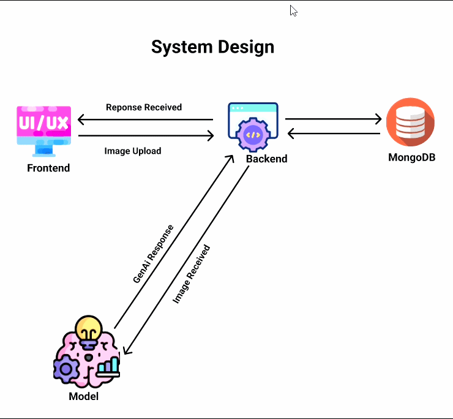

<div align="center">

# ✨ GlamAI

### AI-Powered Face Analysis & Personalized Makeup Recommendation Engine

> An intelligent system that analyzes facial geometry from a single photo and delivers personalized, step-by-step makeup recommendations using computer vision, anthropometric science, and generative AI.

<br>


</div>

<br>

---

<a id="table-of-contents"></a>
## 📋 Table of Contents

| | Section | Description |
|---|---------|-------------|
| 1 | [Overview](#overview) | What GlamAI does and how it works |
| 2 | [Key Features](#key-features) | Core capabilities of the platform |
| 3 | [System Architecture](#system-architecture) | Microservices design and service map |
| 4 | [AI Pipeline](#ai-pipeline) | Four-layer face analysis flow |
| 5 | [CI/CD Pipeline](#cicd-pipeline) | Jenkins automation and security scanning |
| 6 | [Tech Stack](#tech-stack) | Technologies used across the stack |
| 7 | [Project Structure](#project-structure) | Codebase organization |
| 8 | [Getting Started](#getting-started) | Setup and run instructions |
| 9 | [API Reference](#api-reference) | Backend and Model API endpoints |
| 10 | [Kubernetes Deployment](#kubernetes-deployment) | Production K8s manifests |

---

<a id="overview"></a>
## 🧠 Overview

**GlamAI** transforms a user's selfie into personalized makeup guidance. Rather than relying on generic beauty advice, the system measures the unique geometry of each face — eye shape, nose proportions, lip fullness, jawline structure, and more — then retrieves the most relevant professional makeup techniques from a curated knowledge base, enhanced with AI-generated explanations.

```
 📸 Upload Photo  →  🔍 Detect 478 Landmarks  →  📐 Measure Ratios  →  🏷️ Classify Features  →  🤖 Generate Tips  →  📋 Results
```

---

<a id="key-features"></a>
## 🌟 Key Features

| Feature | Description |
|---------|-------------|
| **478-Point Facial Detection** | Google MediaPipe landmark extraction with sub-pixel accuracy |
| **Anthropometric Analysis** | 8 facial regions analyzed with scale-invariant ratios |
| **Rule-Based Classification** | Feature classification grounded in facial morphology science |
| **RAG Recommendations** | ChromaDB vector search + Ollama Phi3 LLM for personalized advice |
| **Secure Authentication** | JWT-based auth with MongoDB user management |
| **Fully Containerized** | Docker Compose for local dev, Kubernetes for production |
| **Enterprise CI/CD** | Jenkins pipelines with SonarQube, OWASP, and Trivy scanning |

---

<a id="system-architecture"></a>
## 🏗 System Architecture

<div align="center">



</div>

<br>

The system follows a **microservices architecture** with three core services:

| Service | Technology | Port | Role |
|---------|-----------|:----:|------|
| **Frontend** | React 19 + Tailwind CSS | `80` | Photo upload UI and result display |
| **Backend** | Node.js + Express 5 | `9000` | Auth, user management, API gateway |
| **Model API** | Python Flask + Gunicorn | `5000` | Face analysis and recommendation engine |
| **Ollama** | Phi3 LLM | `11434` | Local language model for explanations |
| **MongoDB** | Atlas (Cloud) | — | User data and analysis history |

---

<a id="ai-pipeline"></a>
## 🔬 AI Pipeline

Each image is processed through four sequential layers:

| # | Layer | Input | Output | Module |
|:-:|-------|-------|--------|--------|
| 1 | **Landmark Extraction** | Raw image (PNG/JPG) | 478 landmark coordinates `(x, y, z)` | `layer1_extraction.py` |
| 2 | **Metric Calculation** | Landmarks + image dimensions | ~20 normalized ratios and angles | `layer2_metrics.py` |
| 3 | **Feature Classification** | Normalized metrics | Classified features JSON + human text | `layer3_classify.py` |
| 4 | **RAG Generation** | Classifications + Knowledge base | Personalized makeup recommendations | `generation.py` |

**Knowledge Base** — 8 curated JSON files covering **29 technique entries** across face shape, eyes, nose, lips, eyebrows, jawline, chin, and cheekbones.

---

<a id="cicd-pipeline"></a>
## 🔄 CI/CD Pipeline

<div align="center">


</div>

<br>

Each microservice has its own **Jenkins declarative pipeline** following this flow:

```
 ① Clone Code
    │
 ② SonarQube Analysis ──── Static code quality check
    │
 ③ Install Dependencies
    │
 ④ OWASP Dependency Check ── Known CVE scanning
    │
 ⑤ Trivy File System Scan
    │
 ⑥ Docker Build
    │
 ⑦ Docker Image Scan ────── Container vulnerability scan
    │
 ⑧ Push to DockerHub
    │
 ⑨ K8s Rolling Restart
    │
 ⑩ Email Notification ────── Success / Failure alerts
```

### Security Tools

| Tool | Scope | Purpose |
|------|-------|---------|
| **SonarQube** | Source code | Static analysis, code smells, and quality gates |
| **OWASP Dependency-Check** | Dependencies | Known CVE detection in packages |
| **Trivy** | FS + Docker images | Vulnerability scanning at build and runtime |

---

<a id="tech-stack"></a>
## 🛠 Tech Stack

| Category | Technology |
|----------|------------|
| **Frontend** | React 19 · Redux Toolkit · Tailwind CSS · Axios |
| **Backend** | Node.js · Express 5 · Mongoose · JWT · Multer |
| **AI / ML** | Flask · MediaPipe · OpenCV · ChromaDB · Sentence-Transformers |
| **LLM** | Ollama + Phi3 (local inference) |
| **Database** | MongoDB Atlas |
| **Containerization** | Docker · Docker Compose |
| **Orchestration** | Kubernetes — Deployments · Services · HPA · Ingress |
| **CI/CD** | Jenkins (Declarative Pipelines) |
| **Security** | SonarQube · OWASP Dependency-Check · Trivy |

---

<a id="project-structure"></a>
## 📁 Project Structure

```
GlamAI/
│
├── backend - main/              # Node.js backend API
│   ├── src/
│   │   ├── config/db.js         # MongoDB connection
│   │   ├── middleware/auth.js   # JWT authentication
│   │   ├── models/              # Mongoose schemas (User, Image)
│   │   ├── routes/              # API routes (auth, upload)
│   │   └── server.js            # Express entry point
│   ├── k8s/                     # Backend K8s manifests
│   ├── Dockerfile
│   └── Jenkinsfile
│
├── fortend/                     # React frontend
│   ├── src/
│   │   ├── components/          # Login, Signup, FaceAnalysis, etc.
│   │   ├── redux/               # Store, authSlice, subscriptionSlice
│   │   └── services/            # API service layers
│   ├── k8s/                     # Frontend K8s manifests
│   ├── nginx.conf               # Production reverse proxy
│   ├── Dockerfile
│   └── Jenkinsfile
│
├── model/                       # Python AI/ML service
│   ├── knowledge/               # 8 JSON knowledge base files
│   ├── layer1_extraction.py     # MediaPipe landmark extraction
│   ├── layer2_metrics.py        # Anthropometric calculations
│   ├── layer3_classify.py       # Feature classification
│   ├── generation.py            # RAG + LLM recommendations
│   ├── retrieve.py              # ChromaDB vector retrieval
│   ├── app.py                   # Flask API server
│   ├── k8s/                     # Model K8s manifests
│   ├── Dockerfile
│   └── Jenkinsfile
│
├── k8s/                         # Unified K8s manifests
│   ├── 01_namespace.yml
│   ├── 02_configMaps.yml
│   ├── 03_deployment-backend.yml
│   ├── 04_backend-service.yml
│   ├── 05_fortend_deployment.yml
│   ├── 06_fortend_service.yml
│   ├── 07_model_deployment.yml
│   ├── 08_model_service.yml
│   ├── 09_hpa-backend.yml
│   ├── 10_hpa-fortend.yml
│   ├── 11_ingress.yml
│   └── 12_phi_ollama-model.yml
│
├── public/                      # Documentation assets
│   ├── systemDesign.gif
│   └── cicd.gif
│
├── docker-compose.yml           # Full-stack local orchestration
├── .gitignore
└── README.md
```

---

<a id="getting-started"></a>
## 🚀 Getting Started

### Prerequisites

- [Docker](https://docs.docker.com/get-docker/) & [Docker Compose](https://docs.docker.com/compose/install/)
- [Node.js 18+](https://nodejs.org/) *(local development only)*
- [Python 3.11+](https://www.python.org/) *(local development only)*

### Quick Start

```bash
# 1. Clone the repository
git clone https://github.com/Saroj-kr-tharu/GlamAI.git
cd GlamAI

# 2. Create environment files
mkdir -p envirnoment

# 3. Start all services
docker compose up -d
```

> After startup, the Ollama container will automatically pull the **Phi3** model (~2 GB). The Model API health check will pass once the download completes.

### Service URLs

| Service | URL |
|---------|-----|
| **Frontend** | http://localhost |
| **Backend API** | http://localhost:9000 |
| **Model API** | http://localhost:5000 |
| **Ollama** | http://localhost:11434 |

<details>
<summary><strong>📝 Environment Variables</strong></summary>

<br>

**Backend** — `envirnoment/.env.backend`

```env
PORT=5000
MONGO_URI=<mongodb-connection-string>
JWT_SECRET=<your-jwt-secret>
FORTEND_URL=http://localhost:3000
MODEL_API_URL=http://face-api:5000
```

**Model** — `envirnoment/.env.model`

```env
PORT=5000
OLLAMA_HOST=http://ollama:11434
```

</details>

---

<a id="api-reference"></a>
## 📡 API Reference

### Backend API — `http://localhost:9000`

| Method | Endpoint | Description | Auth |
|:------:|----------|-------------|:----:|
| `POST` | `/api/auth/signup` | Register a new user | ✗ |
| `POST` | `/api/auth/login` | Login and receive JWT token | ✗ |
| `POST` | `/api/upload/analyze` | Upload image for face analysis | ✓ |

### Model API — `http://localhost:5000`

| Method | Endpoint | Description |
|:------:|----------|-------------|
| `GET` | `/` | Health check |
| `POST` | `/analyze` | Full face analysis pipeline |

<details>
<summary><strong>📦 Sample Response — POST /analyze</strong></summary>

<br>

```json
{
  "success": true,
  "face_features": {
    "face_shape": { "primary": "oval", "secondary": "round", "ratio": 0.93 },
    "eyes": { "shape": "almond", "orientation": "balanced", "spacing": "balanced" },
    "nose": { "width": "average", "length": "average", "tip": "defined" },
    "lips": { "fullness": "medium", "balance": "balanced", "contour": "natural" },
    "eyebrows": { "arch": "soft arch", "thickness": "natural" },
    "jaw_chin": { "jaw": "balanced", "chin_shape": "balanced" },
    "cheekbones": { "prominence": "moderate", "height": "high-set" }
  },
  "recommendations": [
    {
      "feature": "eyes",
      "variant": "almond",
      "technique": "crease definition",
      "steps": ["Apply light base over lid.", "Define crease softly.", "Extend liner slightly outward."],
      "why_it_matches": "Almond eyes benefit from crease definition to enhance natural depth...",
      "awareness": "Apply gently and blend well to maintain a natural look."
    }
  ]
}
```

</details>

---

<a id="kubernetes-deployment"></a>
## ☸ Kubernetes Deployment

The project includes production-ready Kubernetes manifests in the `k8s/` directory.

```bash
# Apply all manifests in order
kubectl apply -f k8s/01_namespace.yml
kubectl apply -f k8s/02_configMaps.yml
kubectl apply -f k8s/03_deployment-backend.yml
kubectl apply -f k8s/04_backend-service.yml
kubectl apply -f k8s/05_fortend_deployment.yml
kubectl apply -f k8s/06_fortend_service.yml
kubectl apply -f k8s/07_model_deployment.yml
kubectl apply -f k8s/08_model_service.yml
kubectl apply -f k8s/09_hpa-backend.yml
kubectl apply -f k8s/10_hpa-fortend.yml
kubectl apply -f k8s/11_ingress.yml
```

### Resources Overview

| Resource | Description |
|----------|-------------|
| **Namespace** | `glamai-ns` — isolated namespace for all resources |
| **Deployments** | Backend, Frontend, and Model services |
| **Services** | ClusterIP services for internal communication |
| **HPA** | Horizontal Pod Autoscaler for backend and frontend |
| **Ingress** | Path-based routing for external access |
| **ConfigMap** | Centralized environment configuration |

---

<div align="center">

<br>

**GlamAI** — Where computer vision meets beauty science.

*Every face tells a story; GlamAI helps you enhance it.*

<br>

Made with ❤️ by the GlamAI Team

</div>
